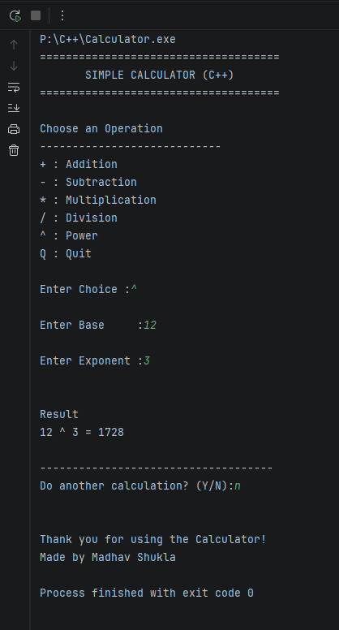

# 🧮 P01 - Console Calculator (C++)

A simple and beginner-friendly calculator built using **C++**. This project demonstrates the fundamentals of C++ programming, including functions, switch-case statements, loops, input validation, and error handling.

---

## 📌 Features

- ➕ Addition
- ➖ Subtraction
- ✖️ Multiplication
- ➗ Division
- 🔺 Power Calculation
- 🔄 Menu-driven interface
- ✅ Input validation
- 🚫 Division by zero protection
- 🔁 Perform multiple calculations without restarting
- 💻 Clean and modular code using functions

---

## 🛠️ Technologies Used

- C++
- Standard Template Library (STL)
- `<iostream>`
- `<cmath>`
- `<limits>`

---

## 📂 Project Structure

```
Calculator/
│
├── Calculator.cpp
├── README.md
├── LICENSE
└── screenshots/
    └── calculator.png
```

---

## 📸 Preview



---

## 📚 Concepts Used

- Variables
- Data Types
- Functions
- Switch Case
- Loops
- User Input
- Mathematical Functions
- Input Validation
- Error Handling

---

## 🎯 Learning Objective

This project was created to strengthen the understanding of fundamental C++ concepts while building a practical console application.

---

## 🤝 Contributing

Contributions, suggestions, and improvements are welcome.

Feel free to fork the repository and submit a pull request.

---

## ⭐ Support

If you found this project helpful, consider giving it a ⭐ on GitHub.

---

## 👨‍💻 Author

**Madhav Shukla**

B.Tech CSE Student | Data Analyst

GitHub: https://github.com/madhavrs2106

LinkedIn: https://linkedin.com/in/madhavshuklar21