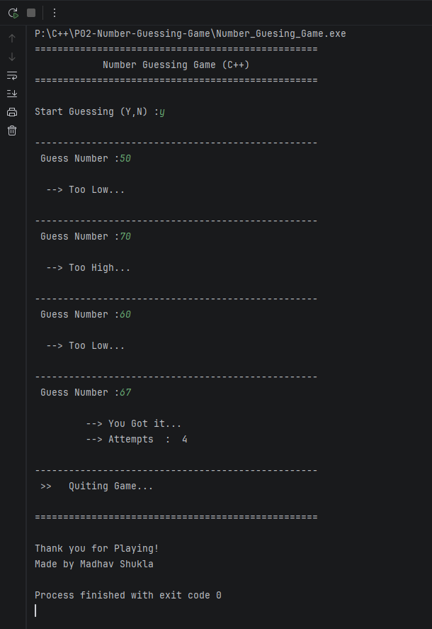

# 🎯 P02 - Number Guessing Game (C++)

---

A simple console-based Number Guessing Game built using modern C++. The computer generates a random number between **1 and 100**, and the player has to guess it with the help of hints until the correct number is found.

This project is part of my **Cpp-Projects** repository and focuses on practicing C++ fundamentals.

---

## ✨ Features

- 🎲 Random number generation using `<random>`
- 💡 "Too High" and "Too Low" hints
- 🔢 Counts total attempts
- 🖥️ Simple console interface
- 🧹 Clean and beginner-friendly code
- ⚡ Built with Modern C++ (C++11+)

---

## 📚 Concepts Used

- Functions
- Loops (`do-while`)
- Conditional Statements (`if-else`)
- User Input / Output
- Random Number Generation
- `<random>` Library
- Code Organization

---

## 🛠 Technologies

- Language: C++
- Standard: C++11 or later
- Compiler: g++
- IDE: Visual Studio Code / Code::Blocks / Visual Studio

---

## 📂 Project Structure

```
Number-Guessing-Game/
│
├── screenshot/
│   └── output-screenshot.png
│
├── main.cpp
├── README.md
└── LICENSE
```

---

## 🎮 How to Play

1. Run the program.
2. Enter **Y** to start the game.
3. Guess a number between **1 and 100**.
4. The program will tell you:
    - 📈 Too High
    - 📉 Too Low
5. Keep guessing until you find the correct number.
6. The game displays your total attempts.

---

## 💻 Example

```text
Guess Number : 25
Too Low...

Guess Number : 80
Too High...

Guess Number : 57
You Got it...
Attempts : 3
```

---

## 📸 Preview




---

---

## 🔮 Future Improvements

- Difficulty Levels
- Limited Attempts
- Score System
- Play Again Option
- Input Validation
- Timer
- High Score Tracking
- Colored Console Output

---

## 👨‍💻 Author

**Madhav Shukla**

Computer Science & Engineering (AI)

Passionate about
- C++
- Data Structures & Algorithms
- Data Analytics
- Software Development

---

⭐ If you found this project helpful, consider giving it a Star!