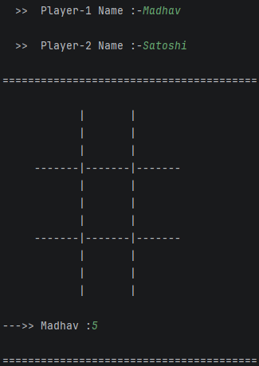
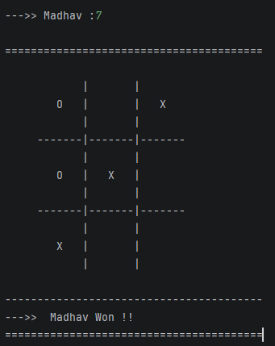
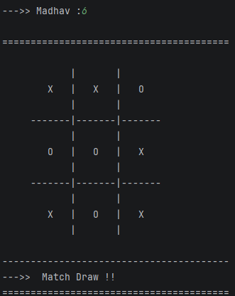

# 🎮 P03 - Tic Tac Toe (C++ Console Game)

---

A console-based **Tic Tac Toe** game developed in **C++**. This project demonstrates fundamental C++ programming concepts including arrays, functions, loops, conditionals, and basic game logic.

---

## ✨ Features

- 🎮 Two Player Mode
- 🧩 Interactive Console Board
- ✅ Win Detection
- 🤝 Draw Detection
- 🚫 Invalid Move Validation
- 👤 Custom Player Names
- 🔄 Turn Switching
- 📋 Clean Modular Functions

---

## 📚 Concepts Used

- Functions
- Arrays
- 2D Arrays
- Loops
- Conditional Statements
- Input Validation
- Game Logic
- Modular Programming

---

## 🛠 Technologies Used

- **Language:** C++
- **Compiler:** g++
- **IDE:** VS Code / Code::Blocks / Visual Studio
- **Platform:** Console Application

---

## 📂 Project Structure

```
P03-Tic-Tac-Toe/
│
├── screenshots/
│    ├── start-game.png
│    ├── draw.png
│    └── winner.png
│
├── Tic_Tac_Toe.cpp
├── .gitignore
├── README.md
└── LICENSE
```

---

## 🎮 How to Play

1. Run the program.
2. Enter the names of **Player 1** and **Player 2**.
3. **Player 1** plays as **X**, and **Player 2** plays as **O**.
4. Players take turns entering a position number from **1 to 9**.
5. The chosen position will be replaced with the player's symbol (**X** or **O**).
6. The first player to align **three symbols** in:
    - ➖ A row
    - │ A column
    - ↘ A diagonal
      wins the game.
7. If all **9 positions** are filled without a winner, the game ends in a **Draw**.
8. Invalid or already occupied positions are rejected, and the player is asked to choose another position.

---

## 📷 Screenshots

```text
Start Game Screenshot
```


```text
Winner Screenshot
```


```text
Draw Screenshot
```


---

## 👨‍💻 Author

**Madhav Shukla**

Computer Science & Engineering (AI)

Passionate about
- C++
- Data Structures & Algorithms
- Data Analytics
- Software Development

---

⭐ If you found this project helpful, consider giving it a Star!